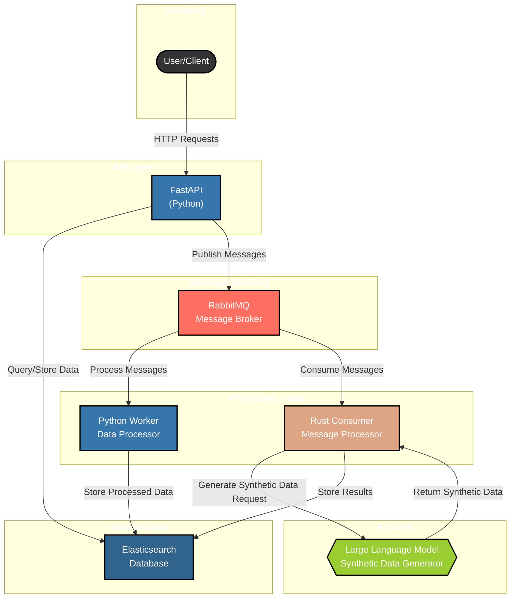

# Synthetic Data Generation Framework Architecture

## Architecture Diagram

The following diagram illustrates the architecture of our Synthetic Data Generation Framework:

## Component Details

### 1. Frontend - User/Client
This represents the entry point where users or external systems interact with our framework. Clients make HTTP requests to the API layer.

### 2. API Layer - FastAPI (Python)
The web framework that handles incoming HTTP requests. It routes requests appropriately and is responsible for:
- Authentication and authorization
- Input validation
- Request routing
- Response formatting
- Publishing messages to RabbitMQ
- Interacting with Elasticsearch for data storage and retrieval

### 3. Message Handling - RabbitMQ
The message broker that enables asynchronous communication between components:
- Queues messages for processing
- Ensures message delivery
- Handles message persistence
- Supports multiple consumers
- Provides message acknowledgment mechanisms

### 4. Processing Layer
Consists of two main components:

#### Python Worker
- Processes messages from RabbitMQ
- Interacts with the LLM to generate synthetic data
- Stores results in Elasticsearch
- Handles retries and error scenarios

#### Rust Consumer
- High-performance message consumer written in Rust
- Optimized for efficiency and throughput
- Processes specific types of messages
- Stores processed data in Elasticsearch

### 5. AI Layer - Large Language Model
The AI component responsible for generating synthetic data:
- Receives requests from the Python Worker
- Generates high-quality synthetic data based on inputs
- Returns data back to the Worker for storage
- Can be configured to use different LLM providers

### 6. Data Storage - Elasticsearch
The database layer that stores:
- Input data from clients
- Generated synthetic data
- Metadata about processing status
- Logs and monitoring information
- Configuration data

## Data Flow

1. A client sends an HTTP request to the FastAPI endpoint
2. FastAPI processes the request and publishes a message to RabbitMQ
3. The Python Worker consumes the message and sends a request to the LLM
4. The LLM generates synthetic data and returns it to the Worker
5. The Worker stores the results in Elasticsearch
6. In parallel, the Rust Consumer can process other types of messages from RabbitMQ
7. The Rust Consumer also stores its processed data in Elasticsearch
8. Clients can query FastAPI to retrieve the generated data from Elasticsearch

This architecture provides a scalable, fault-tolerant approach to synthetic data generation using LLMs. 