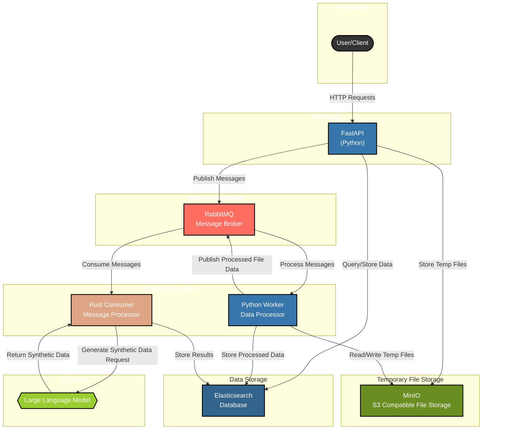

# Synthetic Data Generation Framework Architecture

## Architecture Diagram

The following diagram illustrates the architecture of our Synthetic Data Generation Framework:

## Component Details

### 1. Frontend - User/Client
This represents the entry point where users or external systems interact with our framework. Clients make HTTP requests to the API layer.

### 2. API Layer - FastAPI
The web framework handling HTTP requests and coordinating system components. Responsible for:
- Authentication/authorization and input validation
- Temporary file storage in MinIO
- Publishing processing tasks to RabbitMQ
- Querying/storing metadata in Elasticsearch
- Managing client responses

### 3. Message Handling - RabbitMQ
The message broker enabling asynchronous communication:
- Implements durable queues for message persistence
- Facilitates decoupled component communication
- Supports both Python Worker and Rust Consumer
- Enables load balancing across multiple workers

### 4. Processing Layer

#### Python Worker
- Processes file-based workloads from RabbitMQ
- Manages temporary files in MinIO
- Transforms/preprocesses input data
- Publishes processed data to RabbitMQ for downstream tasks
- Handles data validation and error recovery

#### Rust Consumer
- High-performance message processor for text-based tasks
- Generates synthetic data via LLM integration
- Implements efficient memory management
- Handles retry logic with exponential backoff
- Processes structured data messages

### 5. AI Layer - Large Language Model
The synthetic data generation engine:
- Accessed exclusively by Rust Consumer via API
- Configurable model parameters and providers
- Returns structured data in system format
- Handles rate limiting and API errors

### 6. Data Storage - Elasticsearch
The database layer that stores:
- Input data from clients
- Generated synthetic data
- Metadata about processing status
- Logs and monitoring information
- Configuration data

### 7. Temporary File Storage - MinIO
The S3-compatible object storage layer for temporary file handling:
- Temporarily stores uploaded batch files from clients
- Provides intermediate storage during processing workflows
- Enables efficient file reading/writing for workers
- Manages temporary files until processing is complete
- Not intended for long-term data persistence

## Data Flow

1. A client sends an HTTP request with file data to the FastAPI endpoint
2. FastAPI temporarily stores the uploaded files in MinIO
3. FastAPI publishes a message to RabbitMQ with file metadata
4. The Python Worker consumes the message from RabbitMQ
5. The Worker reads the file from MinIO temporary storage and processes it
6. After processing the file, the Worker publishes new messages back to RabbitMQ with the extracted data
7. The Worker stores the processed data in Elasticsearch for permanent storage
8. In parallel, the Rust Consumer processes messages from RabbitMQ, including those published by the Worker
9. The Rust Consumer generates synthetic data via the LLM and stores results directly in Elasticsearch
10. Once processing is complete, temporary files in MinIO may be cleaned up
11. Clients can query FastAPI to retrieve the permanently stored data from Elasticsearch

This architecture provides a scalable, fault-tolerant approach to synthetic data generation using LLMs with efficient temporary file handling. 