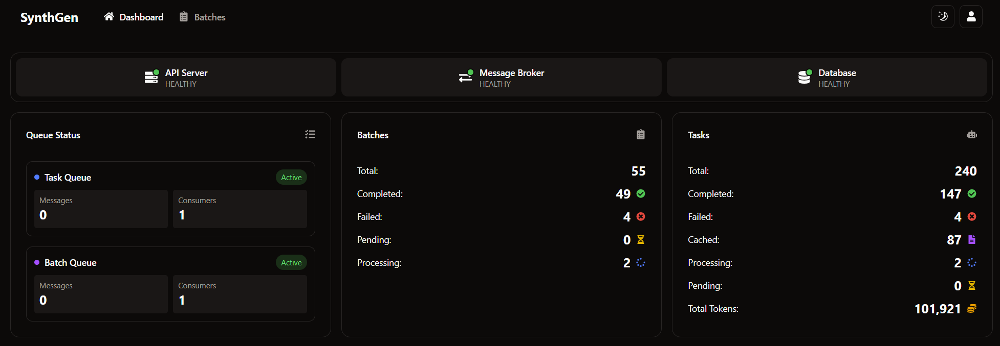

# SynthGen: High-Performance LLM Inference Framework

SynthGen is a framework designed for high-performance LLM inference through parallel processing. Built with a focus on speed, scalability, and observability, SynthGen provides enterprise-grade capabilities for handling large-scale LLM tasks.

## Why SynthGen?

- **Need to reduce costs and improve response times?** SynthGen's caching system automatically reuses responses for identical prompts, eliminating redundant API calls.
- **Struggling with processing thousands of LLM requests efficiently?** Our parallel processing architecture distributes workloads across multiple workers for maximum throughput.
- **Lacking visibility into your LLM operations?** Comprehensive observability features provide real-time metrics, detailed logging, and performance dashboards for complete system transparency.

## Key Features

### ⚡ High-Performance Parallel Processing

- **Distributed Architecture**: Process thousands of LLM inference tasks concurrently across multiple workers
- **Rust-Powered Processing**: Core data processing agent implemented in Rust for maximum throughput and minimal latency
- **Optimized Message Flow**: RabbitMQ-based message broker ensures efficient task distribution and load balancing
- **Parallelism Control**: Configurable parameters for scaling workers

### 💾 Advanced Caching System

- **Intelligent Response Caching**: Automatically cache and reuse responses for identical prompts to reduce API costs
- **Distributed Cache**: Elasticsearch-backed caching system ensures cache consistency across all workers
- **Fine-grained Control**: Per-task cache configuration allowing selective caching based on task requirements

### 🔍 Full Observability

- **Comprehensive Metrics**: Monitor token usage, request rates, latency, and throughput in real-time
- **Detailed Logging**: Structured logging with correlation IDs for end-to-end request tracking
- **Performance Dashboards**: Built-in metrics visualization for system performance analysis
- **Task Tracing**: Full visibility into the lifecycle of each LLM task from submission to completion

### 🔧 Rust-Powered Consumer

- **High-Efficiency Agent**: Core data processing implemented in Rust for optimal performance
- **Memory Safety**: Leverage Rust's memory safety guarantees while maintaining high throughput
- **Low Overhead**: Minimal CPU and memory footprint compared to traditional Python consumers
- **Async Processing**: Non-blocking architecture for maximum throughput and resource utilization
- **Native Extensions**: Easy extension points for custom Rust modules to handle specialized processing needs

### 🔌 Flexible Integration

- **Modern API**: FastAPI-based REST interface with comprehensive OpenAPI documentation
- **Client Libraries**: Official Python client library with async support and rich error handling
- **Message Queue Integration**: Seamless integration with existing message queue systems
- **Multiple LLM Providers**: Support for various LLM providers through LiteLLM integration
- **Storage Backends**: Pluggable storage backends with Elasticsearch and MinIO supported out of the box

## Architecture

SynthGen is built as a distributed system with several specialized components:


## Getting Started

### Prerequisites

- Docker and Docker Compose
- Python 3.8+
- Rust (for consumer development)

### Installation

1. Clone the repository:

   ```bash
   git clone https://github.com/nasirus/synthgen.git
   cd synthgen
   ```

2. Set up environment variables:

   ```bash
   cp .env.example .env
   # Edit .env with your configuration but default values should work out of the box
   ```

3. Start the services:

   ```bash
   docker-compose up -d
   ```

4. Verify the installation:
   ```bash
   curl http://localhost:8000/health
   ```

## Using the Client Library

SynthGen provides a Python client library. See [Synthetic Data Client](https://github.com/nasirus/synthgen-client) for detailed documentation.

```bash
pip install uv
```

```bash
uv venv
```

```bash
uv pip install synthgen-client
```

### Single Task

```python
from synthgen import SynthgenClient
from synthgen.models import Task
from dotenv import load_dotenv
import os

client = SynthgenClient()

# Load environment variables
load_dotenv()

# Check the health of the server
health = client.check_health()
print(health.model_dump_json(indent=4))

# Uncomment the provider url you want to use
# OpenAI
# provider_url = "https://api.openai.com/v1/chat/completions"
# model = "gpt-4o-mini"
# api_key = os.getenv('OPENAI_API_KEY')

# OpenRouter
# provider_url = "https://openrouter.ai/api/v1/chat/completions"
# model = "deepseek/deepseek-r1:free"
# api_key = os.getenv('OPENROUTER_API_KEY')

# Nebius
# provider_url = "https://api.studio.nebius.ai/v1/chat/completions"
# model = "meta-llama/Llama-3.3-70B-Instruct"
# api_key = os.getenv('NEBIUS_API_KEY')

# Hyperbolic
# provider_url = "https://api.hyperbolic.xyz/v1/chat/completions"
# model = "meta-llama/Llama-3.2-3B-Instruct"
# api_key = os.getenv('HYPERBOLIC_API_KEY')

# DeepSeek
# provider_url = "https://api.deepseek.com/chat/completions"
# model = "deepseek-reasoner"
# api_key = os.getenv('DEEPSEEK_API_KEY')

# Local Ollama
# provider_url = "http://host.docker.internal:11434/v1/chat/completions" # Local ollama on host
# model = "llama3.2:3b"
# api_key = "sk-123"

# Litellm
# To convert the non OpenAI provider to OpenAI format, you can use the litellm library, check litell_config.yaml for the provider config
# provider_url = "http://litellm:4000/v1/chat/completions"
# model = "gemini-2.0-flash-001"
# api_key = os.getenv('GEMINI_API_KEY')

# Local Llama-cpp
# Use local model deployed on local container with llama-cpp (default model is qwen2.5-0.5b-instruct), you can change the model in docker-compose.yml
provider_url = "http://llamacpp:3100/v1/chat/completions"
model = "qwen2.5-0.5b-instruct" # The model are optional as llama-cpp will use the default model
api_key = "sk-123"

# Create a task with the provider url and the model
task = Task(
    url=provider_url,
    model=model,
    api_key=api_key,
    # The body is the request body for the provider as standard openai format
    body={
        "model": model,
        "messages": [
            {
                "role": "system",
                "content": "You are a math expert.",
            },
            {"role": "user", "content": "solve 2x + 3 = 30"},
        ],
        "max_tokens": 1000,
        "temperature": 0,
        "stream": False,
    },
)

# Load task to the server and start monitoring, the result is a list of tasks
result = client.monitor_batch([task])

# Print the result of the first task
print(result[0].model_dump_json(indent=4))
```
### Batch Task

```bash
uv pip install datasets
```
```python
import json
import os
from datetime import datetime
from dotenv import load_dotenv
from datasets import load_dataset
from synthgen.sync_client import SynthgenClient
from synthgen.models import Task

load_dotenv()

client = SynthgenClient()


dataset_name = "openai/gsm8k"
dataset_config = "main"
provider_url = "http://llamacpp:3100/v1/chat/completions"
model = "qwen2.5-0.5b-instruct"
api_key = "sk-123"

# Load the dataset
print("Loading dataset...")
dataset = load_dataset(dataset_name, dataset_config)

# Select 10 examples from the test set
data = dataset["test"].select(range(10))

tasks = [
    Task(
        custom_id=f"id-{idx}",
        method="POST",
        url=provider_url,
        api_key=api_key,
        body={
            "model": model,
            "messages": [
                {
                    "role": "system",
                    "content": "You are a math expert. You are given a math problem and you need to solve it",
                },
                {"role": "user", "content": row["question"]},
            ],
            "max_tokens": 1000,
            "temperature": 0,
            "stream": False,
        },
        dataset=dataset_name,
        source=row,
        use_cache=True,
        track_progress=True,
    )
    for idx, row in enumerate(data)
]

# Run inference
print(f"Running inference on {len(tasks)} examples...")

batch = client.monitor_batch(
    tasks=tasks,
    cost_by_1m_input_token=0.3,
    cost_by_1m_output_token=0.6,
)

# Convert to JSON-serializable format
batch_results = [json.loads(task.model_dump_json()) for task in batch]

# Save raw results
benchmark_name = "gsm8k"
date_str = datetime.now().strftime("%Y%m%d_%H%M%S")
raw_results_file = f"raw_results_{benchmark_name}_{date_str}.json"
with open(raw_results_file, "w") as f:
    json.dump(batch_results, f, indent=2)
print(f"Raw results saved to {raw_results_file}")
```
## CLI Dashboard


## UI

http://localhost:3000

API URL: http://localhost:8000

API Key: sk1-1564813548

### Dashboard


### Batches list


### Batches Overview


### Batches Stats


### Batches Tasks


## Caching System

SynthGen implements a caching system to optimize cost and performance:

### How Caching Works

1. **Request Hashing**: Each LLM task is hashed based on its input parameters
2. **Cache Lookup**: Before processing, the system checks if an identical request has been processed before
3. **Cache Hit**: If found, the cached result is returned immediately, saving processing time and API costs
4. **Cache Miss**: If not found, the request is processed normally and the result is cached for future use

### Configuring Caching

Caching can be controlled at multiple levels:

```python
# Disable caching for specific tasks
task = Task(
    # ... task parameters
    use_cache=False
)
```

## Observability

### Metrics Endpoints

- **Health Check**: `GET /health` - Overall system health
- **Task Status**: `GET /api/v1/tasks/{task_id}` - Detailed task information
- **Batche Status**: `GET /api/v1/batches/{batch_id}` - Detailed batch information

### CLI Monitoring Dashboard

When using the `monitor_batch()` function in the client library, a CLI-based dashboard provides real-time insights into:

- Active tasks and throughput
- Cache hit/miss ratio
- Worker and consumer status

## Configuration Options

SynthGen offers extensive configuration options via environment variables, see .env.example file:

| Variable             | Description                           | Default          |
| -------------------- | ------------------------------------- | ---------------- |
| `API_SECRET_KEY`     | API Secret for FastAPI service        | `sk1-1564813548` |
| `API_PORT`           | Port for FastAPI service              | `8000`           |
| `NUM_WORKERS`        | Number of Python worker instances     | `1`              |
| `NUM_CONSUMERS`      | Number of Rust consumer instances     | `1`              |
| `MAX_PARALLEL_TASKS` | Number of parallel tasks per consumer | `10`             |

## Client Libraries

- [Python Client](https://github.com/nasirus/synthgen-client) - Official Python client.


## Contributing

Contributions are welcome! Please see [CONTRIBUTING.md](CONTRIBUTING.md) for details.

## License

This project is licensed under the MIT License - see the [LICENSE](LICENSE) file for details.
